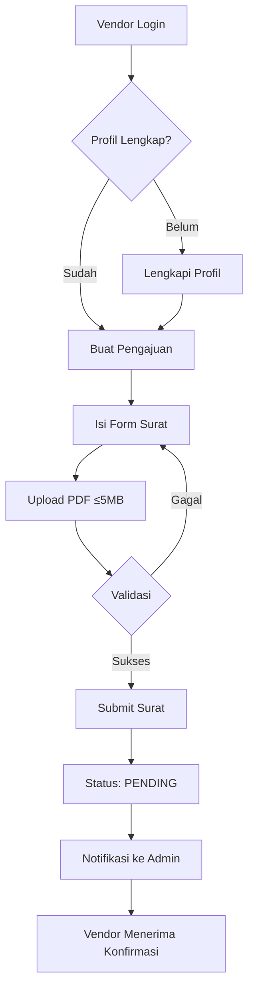
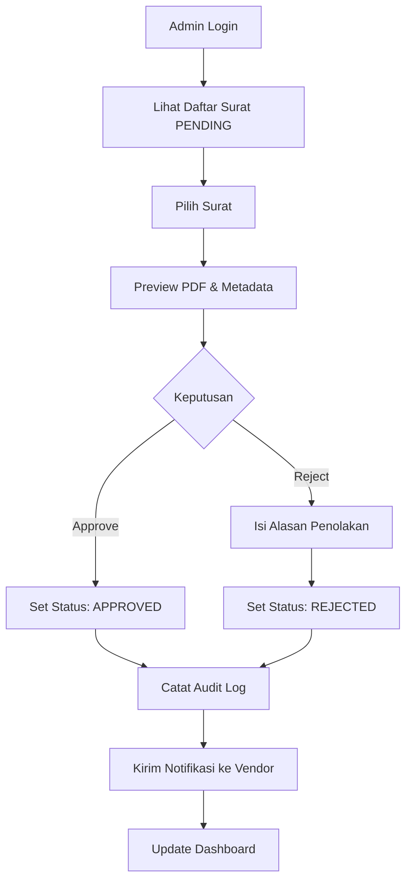

<div align="center">

# 📨 VLAAS

**Vendor Letter Archive & Approval System**

[](https://react.dev/)
[](https://vitejs.dev/)
[](https://supabase.com/)
[](LICENSE)

*Platform Digital Terpadu untuk Manajemen Surat Vendor PT. PLN Persero*

[Fitur](#-fitur-utama) • [Tech Stack](#-tech-stack) • [Arsitektur](#-arsitektur-sistem) • [Instalasi](#-instalasi) • [Dokumentasi](#-dokumentasi)

</div>

---

## 📋 Deskripsi Sistem

**VLAAS** adalah sistem informasi berbasis web yang dirancang khusus untuk PT. PLN Persero guna mengelola proses pengajuan, persetujuan, dan pengarsipan surat dari vendor secara digital, aman, dan terstruktur.

### 🎯 Tujuan Sistem

- **Digitalisasi Proses**: Menggantikan proses manual pengajuan surat vendor yang masih menggunakan fisik/email
- **Transparansi**: Menyediakan tracking real-time status persetujuan surat
- **Keamanan Data**: Implementasi Row Level Security (RLS) dan private storage untuk keamanan tingkat enterprise
- **Audit Trail**: Pencatatan lengkap setiap aktivitas untuk keperluan audit dan compliance
- **Efisiensi Operasional**: Mempercepat proses approval dan mengurangi risiko dokumen hilang

### ❌ Masalah yang Diselesaikan

| Masalah Lama | Solusi VLAAS |
|--------------|--------------|
| Surat vendor tercecer (fisik/email) | Penyimpanan terpusat di cloud storage |
| Tidak ada tracking status | Dashboard real-time dengan notifikasi |
| Proses approval lambat & tidak terstruktur | Workflow approval digital otomatis |
| Arsip sulit dicari | Search engine dengan filter multi-kriteria |
| Tidak ada jejak audit | Audit log lengkap untuk setiap transaksi |

---

## ✨ Fitur Utama

### 👥 Untuk Vendor (Eksternal)

- ✅ **Registrasi & Verifikasi Email** - Pendaftaran akun dengan verifikasi email otomatis
- ✅ **Manajemen Profil Perusahaan** - Kelengkapan data perusahaan (nama, alamat, NPWP)
- ✅ **Pengajuan Surat Digital** - Upload surat format PDF (max 5MB) dengan metadata lengkap
- ✅ **Tracking Status Real-time** - Monitor status surat (Pending, Approved, Rejected)
- ✅ **Notifikasi Otomatis** - Pemberitahuan in-app dan email untuk setiap perubahan status
- ✅ **Riwayat Pengajuan** - Akses penuh ke arsip surat yang pernah diajukan

### 🔐 Untuk Admin PLN (Internal)

- ✅ **Dashboard Monitoring** - Overview statistik dan tren surat masuk
- ✅ **Approval Management** - Setujui atau tolak surat dengan alasan detail
- ✅ **Advanced Search & Filter** - Pencarian berdasarkan vendor, nomor surat, perihal, status, tanggal
- ✅ **Preview PDF Langsung** - Lihat dokumen tanpa perlu download
- ✅ **Audit Log Viewer** - Riwayat lengkap setiap aktivitas persetujuan
- ✅ **Visualisasi Data** - Grafik dan chart untuk analisis tren surat

### 🛡️ Keamanan Enterprise

- 🔒 **Row Level Security (RLS)** - Isolasi data per pengguna di level database
- 🔒 **Private Storage dengan Signed URL** - Akses file hanya dengan URL bertanda waktu
- 🔒 **JWT Authentication** - Session management aman
- 🔒 **Audit Logging** - Pencatatan semua aktivitas sistem
- 🔒 **Email Verification** - Validasi email untuk mencegah registrasi palsu

---

## 🛠️ Tech Stack

### Frontend
- **Framework**: React 19.2.0 - Library UI modern dengan hooks
- **Build Tool**: Vite 7.2.5 - Fast build dan HMR
- **Router**: React Router v6 - Client-side routing
- **Styling**: Tailwind CSS - Utility-first CSS framework
- **Charts**: Chart.js / Recharts - Visualisasi data interaktif
- **HTTP Client**: Axios - Request handling
- **Form Management**: React Hook Form - Form validation
- **State Management**: Context API - Global state

### Backend (Serverless)
- **BaaS**: Supabase - Backend as a Service
  - PostgreSQL Database
  - Authentication & User Management
  - Storage (Private Buckets)
  - Edge Functions (Email notifications)
  - Real-time subscriptions
  - Row Level Security (RLS)

### DevOps & Tools
- **Version Control**: Git + GitHub
- **Package Manager**: npm
- **Linter**: ESLint
- **Deployment**: Vercel / Netlify (Frontend), Supabase (Backend)

---

## 🏗️ Arsitektur Sistem

### Arsitektur Aplikasi

```
┌─────────────────────────────────────────────────────────────┐
│                         FRONTEND                            │
│                    (React + Vite SPA)                       │
│                                                             │
│  ┌──────────────┐  ┌──────────────┐  ┌──────────────┐    │
│  │   Vendor     │  │    Admin     │  │ Super Admin  │    │
│  │  Dashboard   │  │  Dashboard   │  │  Dashboard   │    │
│  └──────────────┘  └──────────────┘  └──────────────┘    │
│                                                             │
│  ┌─────────────────────────────────────────────────────┐  │
│  │           React Router (Client Routing)             │  │
│  └─────────────────────────────────────────────────────┘  │
│                                                             │
│  ┌─────────────────────────────────────────────────────┐  │
│  │             Supabase JS Client                      │  │
│  └─────────────────────────────────────────────────────┘  │
└─────────────────────────────────────────────────────────────┘
                           │
                           │ HTTPS / WSS
                           ▼
┌─────────────────────────────────────────────────────────────┐
│                    SUPABASE BACKEND                         │
│                                                             │
│  ┌─────────────────────────────────────────────────────┐  │
│  │               Auth Service (JWT)                    │  │
│  │  • Email/Password Authentication                    │  │
│  │  • Email Verification                               │  │
│  │  • Session Management                               │  │
│  └─────────────────────────────────────────────────────┘  │
│                                                             │
│  ┌─────────────────────────────────────────────────────┐  │
│  │           PostgreSQL Database + RLS                 │  │
│  │  • users (auth.users)                               │  │
│  │  • vendor_profiles                                  │  │
│  │  • letters                                          │  │
│  │  • approval_logs                                    │  │
│  │  • notifications                                    │  │
│  └─────────────────────────────────────────────────────┘  │
│                                                             │
│  ┌─────────────────────────────────────────────────────┐  │
│  │         Storage (Private Bucket + Signed URL)       │  │
│  │  • letter-documents/ (PDF files)                    │  │
│  └─────────────────────────────────────────────────────┘  │
│                                                             │
│  ┌─────────────────────────────────────────────────────┐  │
│  │             Edge Functions (Deno)                   │  │
│  │  • send-email-notification                          │  │
│  │  • generate-letter-report                           │  │
│  └─────────────────────────────────────────────────────┘  │
└─────────────────────────────────────────────────────────────┘
```

### Database Schema (Simplified)

```sql
-- Users (managed by Supabase Auth)
auth.users
├── id (uuid, PK)
├── email (unique)
├── role (vendor | admin | superadmin)
└── created_at

-- Vendor Profiles
vendor_profiles
├── id (uuid, PK)
├── user_id (uuid, FK → auth.users)
├── company_name (varchar)
├── address (text)
├── phone (varchar)
├── npwp (varchar, nullable)
└── created_at

-- Letters
letters
├── id (uuid, PK)
├── vendor_id (uuid, FK → auth.users)
├── letter_number (varchar, unique)
├── subject (varchar)
├── start_date (date)
├── end_date (date)
├── pdf_url (text)
├── status (enum: PENDING | APPROVED | REJECTED)
├── rejection_reason (text, nullable)
└── timestamps

-- Approval Logs (Audit Trail)
approval_logs
├── id (uuid, PK)
├── letter_id (uuid, FK → letters)
├── admin_id (uuid, FK → auth.users)
├── action (enum: APPROVED | REJECTED)
├── reason (text, nullable)
└── created_at
```

---

## 👥 User Roles & Hak Akses

### 🏢 Vendor (Eksternal)
**Deskripsi**: Perusahaan penyedia barang/jasa ke PLN

**Hak Akses**:
- ✅ Registrasi & login mandiri
- ✅ Kelola profil perusahaan
- ✅ Submit surat dengan upload PDF
- ✅ Lihat status & riwayat surat sendiri
- ✅ Terima notifikasi perubahan status

**Batasan**:
- ❌ Tidak bisa lihat surat vendor lain
- ❌ Tidak bisa edit/hapus surat setelah submit
- ❌ Tidak bisa akses dashboard admin

### 🔐 Admin PLN (Internal)
**Deskripsi**: Pegawai PLN yang menangani surat vendor

**Hak Akses**:
- ✅ Login ke dashboard admin
- ✅ Lihat semua surat dari vendor
- ✅ Approve/Reject surat dengan alasan
- ✅ Search & filter surat
- ✅ Preview PDF
- ✅ Lihat statistik & grafik
- ✅ Akses audit log

**Batasan**:
- ❌ Tidak bisa registrasi mandiri
- ❌ Tidak bisa hapus data

### ⚙️ Super Admin (IT)
**Deskripsi**: Pengelola sistem

**Hak Akses**:
- ✅ Semua hak Admin
- ✅ Buat akun Admin baru
- ✅ Konfigurasi sistem
- ✅ Monitoring & logs

---

## 🔄 Alur Proses Bisnis

### 📤 Alur Pengajuan Surat (Vendor)



### ✅ Alur Persetujuan (Admin)



---

## 📊 Status Surat (State Machine)

```
SUBMITTED ──────► PENDING ────┬────► APPROVED ✅
                               │
                               └────► REJECTED ❌
```

**Aturan**:
- Status bersifat **final** (tidak bisa diubah lagi)
- Tidak ada fitur revisi pada fase 1
- Setiap perubahan status tercatat di audit log

---

## 🚀 Instalasi

### Prerequisites

- Node.js >= 18.x
- npm atau yarn
- Akun Supabase (gratis)
- Git

### 1. Clone Repository

```bash
git clone https://github.com/Codift05/vlaas-pln.git
cd vlaas-pln
```

### 2. Install Dependencies

```bash
npm install
```

### 3. Konfigurasi Environment

Buat file `.env` di root project:

```env
VITE_SUPABASE_URL=your_supabase_url
VITE_SUPABASE_ANON_KEY=your_supabase_anon_key
```

### 4. Setup Database (Supabase)

Jalankan migration SQL di Supabase SQL Editor (lihat folder `/database`)

### 5. Jalankan Development Server

```bash
npm run dev
```

Aplikasi akan berjalan di `http://localhost:5173`

### 6. Build untuk Production

```bash
npm run build
npm run preview
```

---

## 📁 Struktur Folder

```
vlaas-pln/
├── public/                 # Static assets
├── src/
│   ├── assets/            # Images, icons
│   ├── components/        # Reusable components
│   │   ├── common/        # Button, Input, Modal, dll
│   │   ├── vendor/        # Vendor-specific components
│   │   └── admin/         # Admin-specific components
│   ├── pages/             # Page components
│   │   ├── auth/          # Login, Register
│   │   ├── vendor/        # Vendor dashboard
│   │   └── admin/         # Admin dashboard
│   ├── services/          # API services (Supabase)
│   ├── hooks/             # Custom React hooks
│   ├── contexts/          # Context providers
│   ├── utils/             # Helper functions
│   ├── constants/         # Constants & enums
│   ├── routes/            # Route configuration
│   ├── App.jsx            # Main App component
│   └── main.jsx           # Entry point
├── database/              # SQL migrations & schema
├── .env.example           # Environment template
├── package.json
├── vite.config.js
└── README.md
```

---

## 📖 Dokumentasi

### API Documentation

Dokumentasi lengkap API tersedia di: [docs/API.md](docs/API.md) *(coming soon)*

### User Guide

- [Panduan Vendor](docs/VENDOR_GUIDE.md) *(coming soon)*
- [Panduan Admin](docs/ADMIN_GUIDE.md) *(coming soon)*

---

## 🔐 Keamanan

### Security Features

1. **Authentication**: JWT-based dengan email verification
2. **Authorization**: Role-based access control (RBAC)
3. **Row Level Security**: Isolasi data di level database
4. **Private Storage**: File hanya dapat diakses oleh pemilik/admin
5. **Signed URLs**: Temporary access untuk download file
6. **Audit Logging**: Tracking semua aktivitas sensitif
7. **Input Validation**: Server-side & client-side validation
8. **SQL Injection Prevention**: Parameterized queries
9. **XSS Prevention**: Content sanitization

### Reporting Vulnerabilities

Jika menemukan celah keamanan, harap laporkan ke: security@pln.co.id

---

## 🗺️ Roadmap

### ✅ Fase 1 (Current) - MVP
- [x] Setup project structure
- [ ] Implementasi autentikasi
- [ ] Modul pengajuan surat
- [ ] Modul approval
- [ ] Dashboard statistik
- [ ] Sistem notifikasi

### 📋 Fase 2 (Q1 2026)
- [ ] Fitur revisi surat
- [ ] Multi-level approval
- [ ] Export laporan (PDF/Excel)
- [ ] Advanced analytics
- [ ] Mobile responsive optimization

### 🚀 Fase 3 (Q2 2026)
- [ ] API untuk integrasi eksternal
- [ ] Mobile app (React Native)
- [ ] OCR untuk parsing PDF
- [ ] AI-powered document classification

---

## 👨‍💻 Tim Pengembang

Dikembangkan oleh Tim IT PT. PLN Persero

**Maintainer**: [@Codift05](https://github.com/Codift05)

---

## 📄 License

Proprietary - © 2025 PT. PLN Persero. All rights reserved.

Sistem ini dikembangkan untuk penggunaan internal PT. PLN Persero dan tidak dipublikasikan untuk umum.

---

## 📞 Kontak & Support

- **Email**: support-vlaas@pln.co.id
- **Internal Helpdesk**: ext. 1234
- **Issues**: [GitHub Issues](https://github.com/Codift05/vlaas-pln/issues)

---

<div align="center">

**Dibuat dengan ❤️ untuk PT. PLN Persero**

⚡ *Memastikan Listrik untuk Kehidupan yang Lebih Baik* ⚡

</div>
