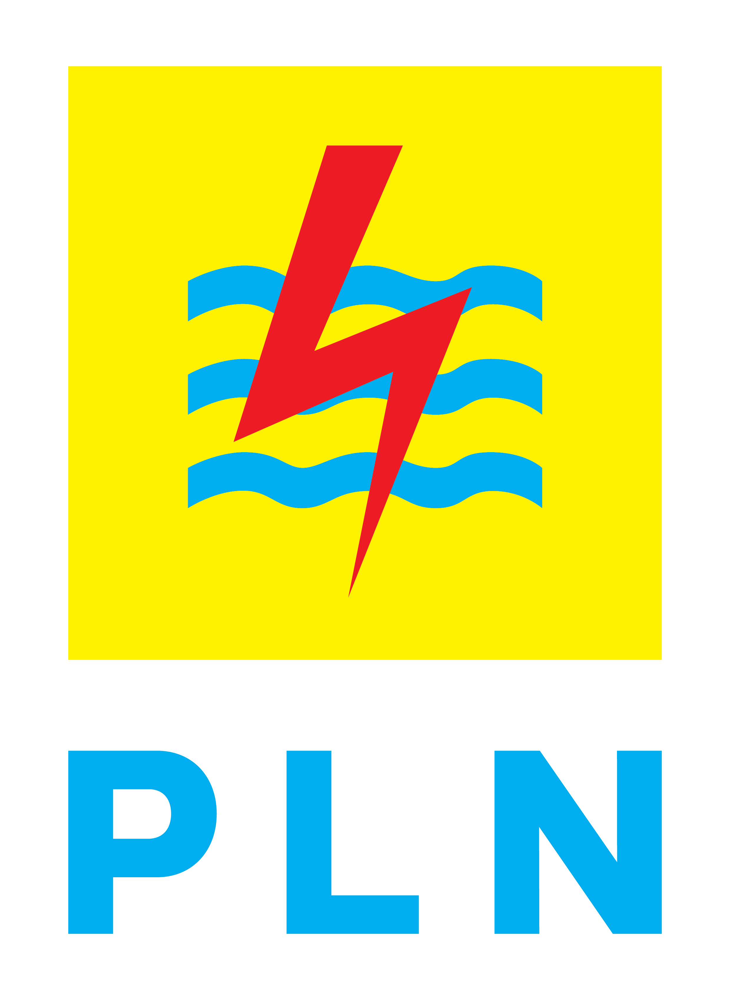

<!-- Logos -->

  
  &nbsp;&nbsp;&nbsp;&nbsp;
  
  &nbsp;&nbsp;&nbsp;&nbsp;
  

# SAKTI
**Sistem Administrasi Kontrak Terintegrasi**

*Platform Digital Terpadu untuk Manajemen Kontrak & Arsip Vendor PT. PLN (Persero)*

[Tentang SAKTI](#tentang-sakti) • [Fitur Unggulan](#fitur-unggulan) • [Mekanisme Sistem](#mekanisme-sistem) • [Teknologi](#teknologi) • [Dokumentasi](#dokumentasi)

---

## Tentang SAKTI

**SAKTI (Sistem Administrasi Kontrak Terintegrasi)** adalah solusi enterprise yang dirancang khusus untuk memodernisasi ekosistem manajemen kontrak dan arsip di lingkungan PT. PLN (Persero). Aplikasi ini mentransformasi proses manual menjadi alur kerja digital yang transparan, aman, dan efisien, mendukung inisiatif _paperless office_ dan _good corporate governance_.

Sistem ini menjembatani komunikasi antara **Vendor** (Penyedia Barang/Jasa) dan **Manajemen PLN** melalui portal terpadu yang memfasilitasi pengajuan dokumen, verifikasi berlapis, hingga pengarsipan digital otomatis yang terstruktur.

---

## Fitur Unggulan

### 🏢 Portal Vendor (Eksternal)
- **Registrasi & Identitas Digital**: Vendor dapat mendaftar mandiri dengan validasi email dan pengelolaan profil perusahaan (NPWP, Alamat, Kontak).
- **Pengajuan Dokumen Terpusat**: Upload dokumen kontrak dan surat administrasi dalam format PDF dengan validasi otomatis.
- **Monitoring Status Real-time**: Tracking posisi dokumen (Pending, Approved, Rejected) secara transparan melalui dashboard vendor.
- **Notifikasi Cerdas**: Pemberitahuan otomatis via sistem untuk setiap update status dokumen.

### ⚡ Dashboard Manajemen PLN (Internal)
- **Executive Dashboard**: Visualisasi data statistik kontrak, tren pengajuan, dan kinerja vendor dalam bentuk grafik interaktif.
- **Sistem Approval Berjenjang**: Mekanisme persetujuan dokumen dengan fitur tinjauan visual (preview PDF) tanpa perlu download.
- **Manajemen Arsip Digital**: Pencarian dokumen cerdas (Smart Search) berdasarkan metadata kontrak, nama vendor, atau tanggal.
- **Manajemen Pengguna**: Pengelolaan hak akses bertingkat (Super Admin, Admin, Verifikator).

### 🔐 Keamanan & Integritas Data
- **Audit Trail Lengkap**: Perekaman jejak digital untuk setiap aktivitas (Login, Upload, Approval, Reject) guna keperluan audit.
- **Auto-Cleanup Policy**: Kebijakan retensi otomatis untuk membersihkan file sementara yang kadaluarsa guna optimalisasi penyimpanan.
- **Secure Storage**: Penyimpanan file berbasis cloud dengan enkripsi dan akses token terbatas (Signed URLs).

---

## Mekanisme Sistem

Berikut adalah alur kerja (workflow) komprehensif dari sistem SAKTI:

### 1. Tahap Registrasi & Verifikasi Vendor
1.  **Registrasi**: Vendor mendaftarkan akun perusahaan melalui portal SAKTI.
2.  **Validasi**: Sistem mengirimkan email verifikasi untuk memastikan keabsahan kontak.
3.  **Lengkapi Profil**: Vendor melengkapi data legalitas perusahaan (NPWP, Alamat Operasional, PIC).

### 2. Tahap Pengajuan Kontrak (Vendor Submission)
1.  **Inisiasi Pengajuan**: Vendor membuat pengajuan baru dengan mengisi metadata kontrak (Nomor Kontrak, Judul, Tanggal Mulai/Akhir).
2.  **Digital Upload**: Vendor mengunggah berkas kontrak dalam format PDF (Maksimal 5MB).
3.  **Auto-Validation**: Sistem secara otomatis memvalidasi format dan ukuran file sebelum disimpan ke _Temporary Storage_.
4.  **Status**: Dokumen ditandai dengan status **PENDING**.

### 3. Tahap Verifikasi & Approval (PLN Admin)
1.  **Notifikasi Masuk**: Admin menerima notifikasi adanya pengajuan baru di Dashboard.
2.  **Review Dokumen**: Admin memeriksa kelengkapan administrasi dan melihat _preview_ dokumen secara langsung di aplikasi.
3.  **Pengambilan Keputusan**:
    - **APPROVE**: Jika dokumen valid dan sesuai. Status berubah menjadi **APPROVED**. Dokumen dipindahkan ke Arsip Permanen (Google Drive Terintegrasi).
    - **REJECT**: Jika terdapat kesalahan. Admin wajib menyertakan alasan penolakan. Status berubah menjadi **REJECTED**.
4.  **Notifikasi Balik**: Vendor menerima notifikasi hasil keputusan secara real-time.

### 4. Tahap Pengarsipan & Pemeliharaan (System Lifecycle)
1.  **Arsip Digital**: Dokumen yang disetujui tersimpan rapi dengan struktur folder dinamis: `Arsip/[Tahun]/[Vendor]/[Kontrak]`.
2.  **Kebijakan Retensi**: Sistem menjalankan _background job_ untuk menghapus file pengajuan yang ditolak atau tidak ditindaklanjuti lebih dari 7 hari (Auto-Cleanup) untuk menjaga kebersihan penyimpanan.
3.  **Pelaporan**: Data transaksi diolah menjadi laporan eksekutif untuk manajemen.

---

## Teknologi

SAKTI dibangun di atas infrastruktur teknologi modern yang handal dan *scalable*:

- **Frontend**: [Next.js 16](https://nextjs.org/) (React Framework) - Menjamin performa tinggi dan UX yang responsif.
- **Backend & Database**: [Supabase](https://supabase.com/) (PostgreSQL) - Database relasional yang kuat dengan keamanan Row Level Security (RLS).
- **Storage Integration**: Google Drive API & Supabase Storage - Untuk penyimpanan dokumen skala besar.
- **Security**: JWT Authentication, Role-Based Access Control (RBAC), dan Enkripsi SSL/TLS.
- **Deployment**: Vercel Cloud Platform.

---

## Kontak & Dukungan

**PT. PLN (Persero) - Unit Pelaksana Transmisi (UPT) Manado**
*Divisi Teknologi Informasi & Umum*

Untuk kendala teknis atau pertanyaan seputar penggunaan sistem SAKTI, silakan hubungi tim administrator IT internal.

---

  <small>© 2026 PT. PLN (Persero). Hak Cipta Dilindungi Undang-Undang.</small>
   
  <small>SAKTI v2.0 - <i>Transformasi Digital untuk Indonesia Terang</i></small>

